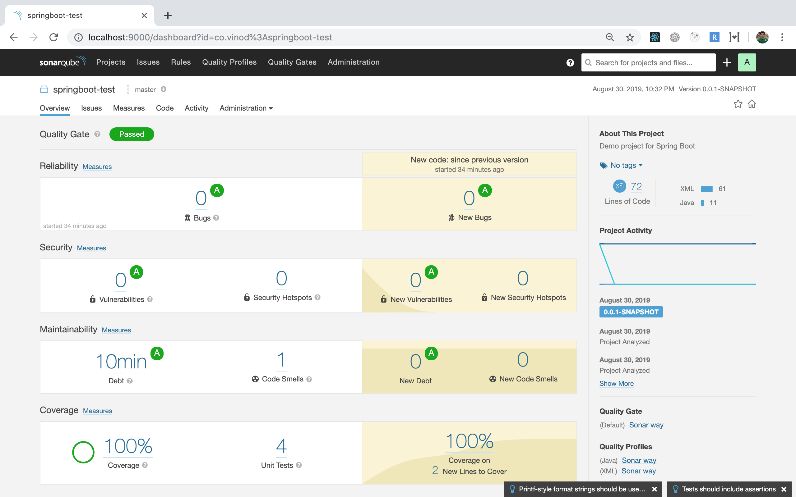

# Spring boot + Test + Sonar + Jacoco

Make sure that Sonar-Server is running at port 9000

Run the command:

`mvn test sonar:sonar` to generate the test results along with Jacoco code coverage and publish to the Sonar-Server.

